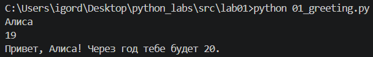
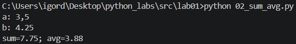
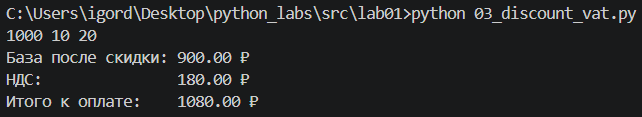
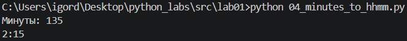
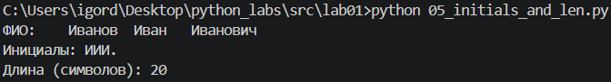

## ЛР1 - Ввод/вывод и форматирование

### Задание 1

```python
name = input('Имя: ')
age = int(input('Возраст: '))
print(f'Привет, {name}! Через год тебе будет {age+1}.')
```



### Задание 2

```python
a = float(input('a: ').replace(',', '.'))
b = float(input('b: ').replace(',', '.'))
print(f'sum={a + b}; avg={(a + b) / 2:.2f}')
```



### Задание 3

```python
price = float(input('price: '))
discount = float(input('discount: '))
vat = float(input('vat: '))
base = price * (1 - discount/100)
vat_amount = base * (vat/100)
total = base + vat_amount
print(f'База после скидки: {base:.2f} ₽')
print(f'НДС:               {vat_amount:.2f} ₽')
print(f'Итого к оплате:    {total:.2f} ₽')
```



### Задание 4

```python
m = int(input('Минуты: '))
print(f'{m // 60}:{m % 60:02d}')
```



### Задание 5

```python
f, i, o = input('ФИО: ').split()
print(f'Инициалы: {f[0].upper()}{i[0].upper()}{o[0].upper()}.')
print(f'Длина (символов): {len(f) + len(i) + len(o) + 2}')
```

