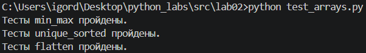
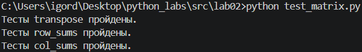
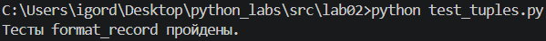

## ЛР2 - Коллекции и матрицы (list/tuple/set/dict)

### Задание 1

Код arrays.py:
```python
def min_max(nums: list[float | int]) -> tuple[float | int, float | int]:
    """Возвращает кортеж (минимум, максимум). Если список пуст — ValueError."""

    if len(nums) == 0:
        raise ValueError
    
    return (min(nums), max(nums))

def unique_sorted(nums: list[float | int]) -> list[float | int]:
    """Возвращает отсортированный список уникальных значений (по возрастанию)."""

    return sorted(set(nums))

def flatten(mat: list[list | tuple]) -> list:
    """«Расплющивает» список списков/кортежей в один список по строкам (row-major). Если встретилась строка/элемент, который не является списком/кортежем — TypeError."""

    result = []

    for array in mat:
        if type(array) != list and type(array) != tuple:
            raise TypeError
        for x in array:
            result.append(x)
    
    return result
```

Код test_arrays.py:
```python
from arrays import *

def test_min_max() -> None:
    """Тест функции min_max. Печатает, пройдены ли её тесты."""

    testcases = (
        ([3, -1, 5, 5, 0], (-1, 5)),
        ([42], (42, 42)),
        ([-5, -2, -9], (-9, -2)),
        ([1.5, 2, 2.0, -3.1], (-3.1, 2))
    )
    for test_data, expected in testcases:
        if min_max(test_data) != expected:
            print('Тесты min_max не пройдены.')
            break
    else:
        print('Тесты min_max пройдены.')

def test_unique_sorted() -> None:
    """Тест функции unique_sorted. Печатает, пройдены ли её тесты."""

    testcases = (
        ([3, 1, 2, 1, 3], [1, 2, 3]),
        ([], []),
        ([-1, -1, 0, 2, 2], [-1, 0, 2]),
        ([1.0, 1, 2.5, 2.5, 0], [0, 1.0, 2.5])
    )
    for test_data, expected in testcases:
        if unique_sorted(test_data) != expected:
            print('Тесты unique_sorted не пройдены.')
            break
    else:
        print('Тесты unique_sorted пройдены.')

def test_flatten() -> None:
    """Тест функции flatten. Печатает, пройдены ли её тесты."""

    testcases = (
        ([[1, 2], [3, 4]], [1, 2, 3, 4]),
        ([[1, 2], (3, 4, 5)], [1, 2, 3, 4, 5]),
        ([[1], [], [2, 3]], [1, 2, 3])
    )
    for test_data, expected in testcases:
        if flatten(test_data) != expected:
            print('Тесты flatten не пройдены.')
            break
    else:
        print('Тесты flatten пройдены.')

def test_arrays() -> None:
    """Тест всех функций из arrays. Для каждой функции печатает, пройдены ли её тесты."""

    test_min_max()
    test_unique_sorted()
    test_flatten()

test_arrays()
```

Результат тестов:


### Задание 2

Код matrix.py:
```python
def transpose(mat: list[list[float | int]]) -> list[list]:
    """Меняет строки и столбцы местами. Пустая матрица [] → []. Если матрица «рваная» (строки разной длины) — ValueError."""

    if len(mat) == 0:
        return []
    
    if not all(len(mat[i]) == len(mat[0]) for i in range(1, len(mat))):
        raise ValueError
    
    n, m = len(mat), len(mat[0])
    result = [[0 for _ in range(n)] for _ in range(m)]

    for i in range(n):
        for j in range(m):
            result[j][i] = mat[i][j]

    return result

def row_sums(mat: list[list[float | int]]) -> list[float]:
    """Сумма по каждой строке. Если матрица «рваная» (строки разной длины) — ValueError."""

    if len(mat) == 0:
        return 0
    
    if not all(len(mat[i]) == len(mat[0]) for i in range(1, len(mat))):
        raise ValueError
    
    return [sum(row) for row in mat]

def col_sums(mat: list[list[float | int]]) -> list[float]:
    """Сумма по каждому столбцу. Если матрица «рваная» (строки разной длины) — ValueError."""

    if len(mat) == 0:
            return 0
        
    if not all(len(mat[i]) == len(mat[0]) for i in range(1, len(mat))):
        raise ValueError
        
    n, m = len(mat), len(mat[0])

    return [sum(mat[i][j] for i in range(n)) for j in range(m)]
```

Код test_matrix.py:
```python
from matrix import *

def test_transpose() -> None:
    """Тест функции transpose. Печатает, пройдены ли её тесты."""

    testcases = (
        ([[1, 2, 3]], [[1], [2], [3]]),
        ([[1], [2], [3]], [[1, 2, 3]]),
        ([[1, 2], [3, 4]], [[1, 3], [2, 4]]),
        ([], [])
    )
    for test_data, expected in testcases:
        if transpose(test_data) != expected:
            print('Тесты transpose не пройдены.')
            break
    else:
        print('Тесты transpose пройдены.')

def test_row_sums() -> None:
    """Тест функции row_sums. Печатает, пройдены ли её тесты."""

    testcases = (
        ([[1, 2, 3], [4, 5, 6]], [6, 15]),
        ([[-1, 1], [10, -10]], [0, 0]),
        ([[0, 0], [0, 0]], [0, 0])
    )
    for test_data, expected in testcases:
        if row_sums(test_data) != expected:
            print('Тесты row_sums не пройдены.')
            break
    else:
        print('Тесты row_sums пройдены.')

def test_col_sums() -> None:
    """Тест функции col_sums. Печатает, пройдены ли её тесты."""

    testcases = (
        ([[1, 2, 3], [4, 5, 6]], [5, 7, 9]),
        ([[-1, 1], [10, -10]], [9, -9]),
        ([[0, 0], [0, 0]], [0, 0])
    )
    for test_data, expected in testcases:
        if col_sums(test_data) != expected:
            print('Тесты col_sums не пройдены.')
            break
    else:
        print('Тесты col_sums пройдены.')

def test_matrix() -> None:
    """Тест всех функций из matrix. Для каждой функции печатает, пройдены ли её тесты."""

    test_transpose()
    test_row_sums()
    test_col_sums()

test_matrix()
```

Результат тестов:


### Задание 3

Код tuples.py:
```python
type student = tuple[str, str, float]

def format_record(rec: student) -> str:
    """Возвращает строку вида: 'Иванов И.И., гр. BIVT-25, GPA 4.60'. Некорректное/пустое ФИО, пустая группа или неверный GPA — ValueError"""

    if rec[0] == '' or rec[1] == '' or rec[2] < 0 or rec[2] > 5:
        raise ValueError

    fio = rec[0].split()
    if len(fio) < 2 or len(fio) > 3:
        raise ValueError

    fio[0] = fio[0][0].upper() + fio[0][1:]
    fio[1] = fio[1][0].upper() + '.'
    fio_string = f'{fio[0]} {fio[1]}'
    if len(fio) > 2:
        fio[2] = fio[2][0].upper() + '.'
        fio_string += fio[2]

    return f'{fio_string}, гр. {rec[1]}, GPA {rec[2]:.2f}'
```

Код test_tuples.py:
```python
from tuples import *

def test_format_record() -> None:
    """Тест функции format_record. Печатает, пройдены ли её тесты."""

    testcases = (
        (("Иванов Иван Иванович", "BIVT-25", 4.6), "Иванов И.И., гр. BIVT-25, GPA 4.60"),
        (("Петров Пётр", "IKBO-12", 5.0), "Петров П., гр. IKBO-12, GPA 5.00"),
        (("Петров Пётр Петрович", "IKBO-12", 5.0), "Петров П.П., гр. IKBO-12, GPA 5.00"),
        (("  сидорова  анна   сергеевна ", "ABB-01", 3.999), "Сидорова А.С., гр. ABB-01, GPA 4.00")
    )
    for test_data, expected in testcases:
        if format_record(test_data) != expected:
            print('Тесты format_record не пройдены.')
            break
    else:
        print('Тесты format_record пройдены.')

def test_tuples() -> None:
    """Тест всех функций из tuples. Для каждой функции печатает, пройдены ли её тесты."""

    test_format_record()

test_tuples()
```

Результат тестов:
