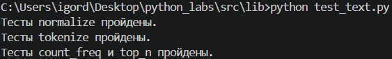
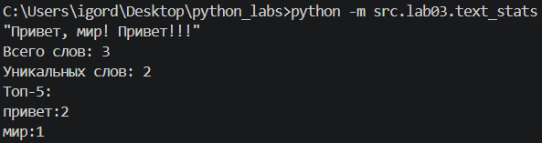

## ЛР3 — Тексты и частоты слов (словарь/множество)

### Задание 1

Код lib/text.py:
```python
from re import *

def normalize(text: str, *, casefold: bool = True, yo2e: bool = True) -> str:
    """Если casefold=True, приводит text к casefold, иначе lower().
    Если yo2e=True, заменяет ё / Ё на е / Е.
    Убирает невидимые управляющие символы (\\t, \\r, ...) — заменяет на пробелы, схлопывает повторяющиеся пробелы в один.
    Неверный тип любого из аргументов — TypeError."""
    if type(text) != str or type(casefold) != bool or type(yo2e) != bool:
        raise TypeError
    if casefold:
        text = text.casefold()
    else:
        text = text.lower()
    if yo2e:
        text = text.replace('ё', 'е').replace('Ё', 'Е')
    text = text.strip()
    text = ' '.join(text.split())
    text = text.strip()
    return text

def tokenize(text: str) -> list[str]:
    """Разбивает на «слова» по небуквенно-цифровым разделителям.
    Слово — последовательность символов \\w (буквы/цифры/подчёркивание) плюс дефис внутри слова (например, по-настоящему).
    Числа (например, 2025) считаются словами.
    Неверный тип text — TypeError."""
    if type(text) != str:
        raise TypeError
    tokens = findall(r'\w+(?:-\w+)*', text)
    return tokens

def count_freq(tokens: list[str]) -> dict[str, int]:
    """Подсчитывает частоты, возвращает словарь (слово, количество).
    Неверный тип tokens — TypeError."""
    if type(tokens) != list or len(tokens) > 0 and type(tokens[0]) != str:
        raise TypeError
    freq = dict()
    for token in tokens:
        if token not in freq:
            freq[token] = 1
        else:
            freq[token] += 1
    return freq

def top_n(freq: dict[str, int], n: int = 5) -> list[tuple[str, int]]:
    """Возвращает топ-N по убыванию частоты; при равенстве — по алфавиту слова.
    Неверный тип любого из аргументов — TypeError."""
    if type(freq) != dict or type(n) != int:
        raise TypeError
    return sorted(freq.items(), key=lambda kv: (-kv[1], kv[0]))[:n]
```

Код lib/test_text.py:
```python
from text import *

def test_normalize() -> None:
    """Тест функции normalize. Печатает, пройдены ли её тесты."""
    testcases = (
        ("ПрИвЕт\nМИр\t", "привет мир"),
        ("ёжик, Ёлка", "ежик, елка"),
        ("Hello\r\nWorld", "hello world"),
        ("  двойные   пробелы  ", "двойные пробелы")
    )
    for test_data, expected in testcases:
        if normalize(test_data) != expected:
            print('Тесты normalize не пройдены.')
            break
    else:
        print('Тесты normalize пройдены.')

def test_tokenize() -> None:
    """Тест функции tokenize. Печатает, пройдены ли её тесты."""
    testcases = (
        ("привет мир", ["привет", "мир"]),
        ("hello,world!!!", ["hello", "world"]),
        ("по-настоящему круто", ["по-настоящему", "круто"]),
        ("2025 год", ["2025", "год"]),
        ("emoji 😀 не слово", ["emoji", "не", "слово"])
    )
    for test_data, expected in testcases:
        if tokenize(test_data) != expected:
            print('Тесты tokenize не пройдены.')
            break
    else:
        print('Тесты tokenize пройдены.')

def test_count_freq_top_n():
    """Тест функций count_freq и top_n. Печатает, пройдены ли их тесты."""
    testcases = (
        (["a", "b", "a", "c", "b", "a"], {"a":3,"b":2,"c":1}, [("a",3), ("b",2)]),
        (["bb","aa","bb","aa","cc"], {"aa":2,"bb":2,"cc":1}, [("aa",2), ("bb",2)])
    )
    for test_data, expected_count_freq, expected_top_n in testcases:
        if count_freq(test_data) != expected_count_freq:
            print('Тесты count_freq не пройдены.')
            break
        if top_n(expected_count_freq, 2) != expected_top_n:
            print('Тесты top_n не пройдены.')
            print(top_n(expected_count_freq, 2), expected_top_n)
            break
    else:
        print('Тесты count_freq и top_n пройдены.')

def test_text() -> None:
    test_normalize()
    test_tokenize()
    test_count_freq_top_n()

test_text()
```

Результат тестов:


### Задание 2

Код text_stats.py:
```python
from ..lib.text import normalize, tokenize, count_freq, top_n

text = input()
tokens = tokenize(normalize(text))
print(f'Всего слов: {len(tokens)}')
unique_tokens = set(tokens)
print(f'Уникальных слов: {len(unique_tokens)}')
top = top_n(count_freq(tokens), 5)
print(f'Топ-5:')
for x, y in top:
    print(f'{x}:{y}')
```

Результат работы программы:
